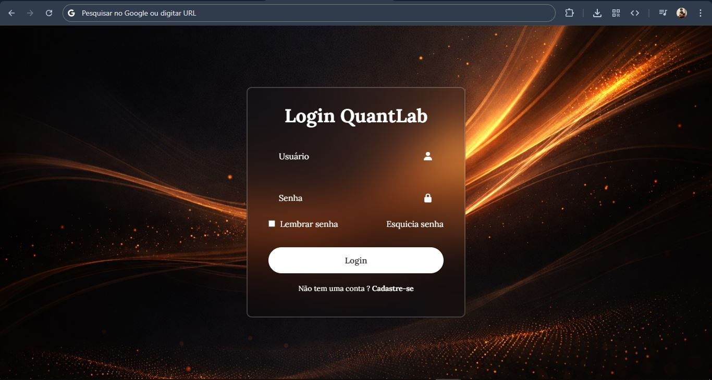
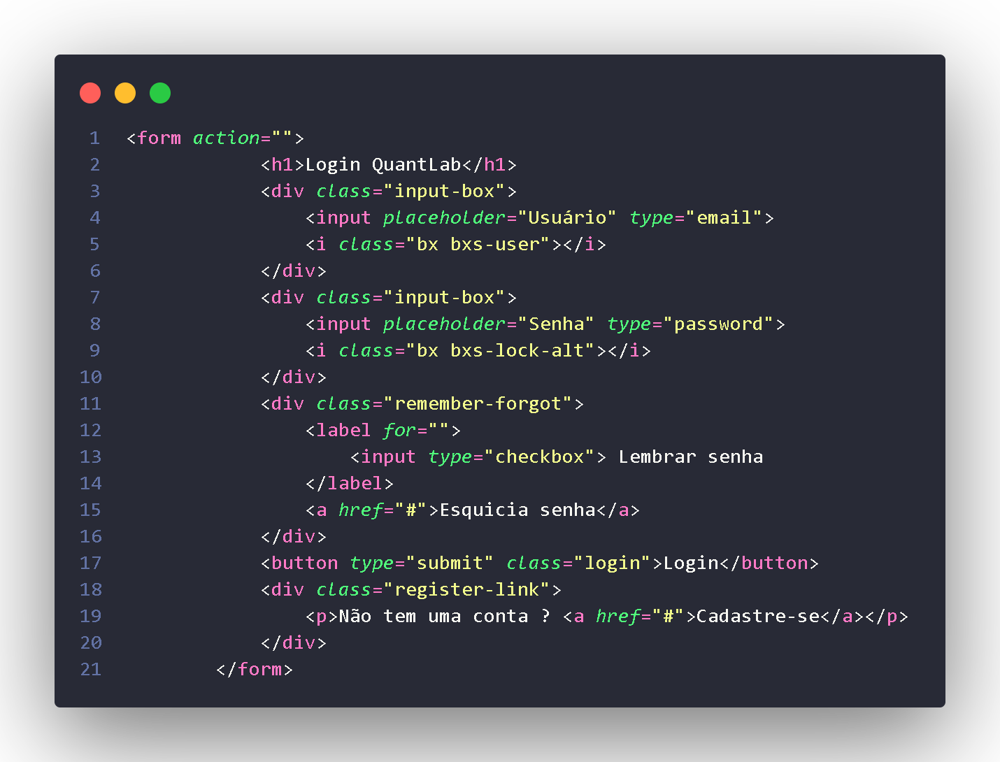

<h1>
  📃 Formulário de Cadastro
</h1>
<h5>
    Projeto focado na construção de formulários modernos e organizados utilizando HTML e CSS.  
    Acesse a versão online: 
    <a href="https://filiple15.github.io/projetosGerais/TelaLogin/frontend/index.html"><strong>Visualizar Projeto</strong></a>
</h5>

---

## ✉️ Sobre o projeto

<table>
  <tr>
    <td>
      
    </td>
    <td>

<strong>Data de início:</strong> 01/04/2026  
<strong>Data de conclusão:</strong> 02/04/2026  

Este projeto foi desenvolvido com o objetivo de praticar a criação de formulários bem estruturados e visualmente organizados, aplicando boas práticas de HTML semântico e estilização com CSS.

Durante o desenvolvimento, foi dada atenção especial à clareza dos campos, organização visual e experiência do usuário, garantindo um layout simples, porém funcional e intuitivo.
  </tr>
</table>

---

## 🏹 Objetivos

- Melhorar a estruturação de formulários HTML  
- Praticar estilização com CSS  
- Criar interfaces limpas e organizadas  
- Desenvolver consistência visual  

---

## 💻 Tecnologias utilizadas

<table>
  <tr>
    <td>

###  HTML5 — Estrutura e Semântica  
O HTML5 foi utilizado como base do projeto, sendo responsável por toda a **estrutura do formulário**.
👉 Foco: estrutura limpa, organizada e compreensível.

---

### CSS3 — Estilização e Experiência do Usuário  
O CSS3 foi utilizado para transformar a estrutura em uma interface visual agradável.
👉 Foco: clareza visual e usabilidade.
  <td>
      
    </td>
  </tr>
</table>
